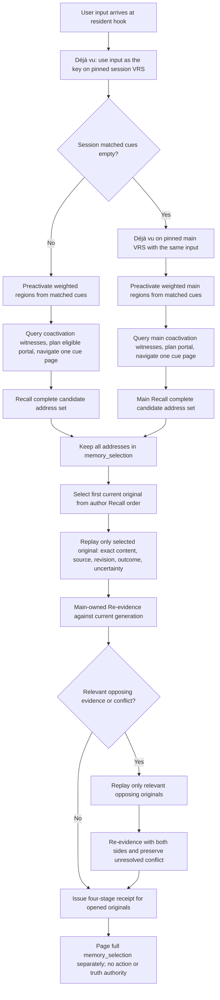
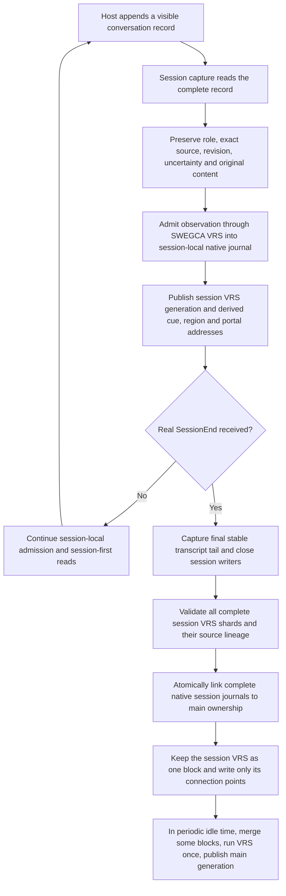

# SWEGCA VRS-MCP logic order — approved 2026-09-22

The user approved the flow with `순서맞음 ㄱㄱ` on 2026-09-22. Claude's
16:33 KST review records the three N/C/E corrections that accompanied the
reviewed flow: receipt cardinality, complete pre-Replay timing, and Déjà vu
miss detection. This revision writes those corrections into the diagram. It
is not an implementation claim or a test result.

## User input and memory read

The input is not subjected to a model decision, old capsule lookup, main
fallback probe, transcript scan, or cold index build before Déjà vu. Author
region preactivation, coactivation query, portal planning, and one bounded
local-navigation page sit between Déjà vu and Recall. The <1 ms gate covers
Déjà vu, navigation, and completion of Recall before Replay. First Recall
entry, Replay, and MCP completion are separate diagnostics. Main fallback
latency is reported separately and is not hidden by session timing.
The target begins when the host receives the user input, including dispatch
before the hook. Hook entry is an internal diagnostic start only. Without a
host input timestamp, the full target remains unverified.

The session-to-main miss is `matched_cues == ()` at Déjà vu. A zero-candidate
Recall records an honest miss and no Replay. Navigation follows the author's
single eligible portal and one cue page; deferred regions remain explicit, so
the result does not claim a complete transitive graph search. A transport page
limit never removes a Recall address. The receipt's Recall, Replay, and
Re-evidence rows bind one-to-one for the opened originals; the full Recall
address set remains separately in `memory_selection`. A historical result or
retrieval rank cannot grant authority.

## Experience admission and SessionEnd

The transcript cursor keeps positions and exact VRS addresses, not recalled
content. A record is not promoted to semantic truth simply because it was
admitted. `Interrupt`, silence, and elapsed time are not SessionEnd. The link
transfers ownership durably after SessionEnd; the session VRS is then kept as
one block with only its connection points written (user 2026-09-23), and some
blocks are merged with one VRS run in periodic idle time. Original session journals remain available. Neither
step reads the transcript as a recall source or runs before SessionEnd.
Visible tool results are admitted as ordered source-bound VRS observations as
well. A result longer than one author observation field is split while
preserving its byte/line spans, digest, role, revision, and part order.

## Authority and background work

Only main-owned SWEGCA evidence accumulation and judgment can change a
persistent belief. A read receipt and an observation admission grant no World,
action, semantic promotion, model-update, distribution, or P3 authority.
Consolidation and derived-index publication are background generation work;
independent preparation can use the 16-thread CPU. They cannot stand in front of
the input → Déjà vu → navigation → Recall path. Memory and disk budgets remain hard
limits without deleting experiences, regions, portals, or evidence logic.

## Approved read-route points

1. Déjà vu reads the active session VRS first. Empty matched cues trigger
   Déjà vu, navigation, and Recall on main with the same input.
2. Region preactivation, membership lookup, coactivation witness query,
   portal planning, and one local-navigation page follow Déjà vu and feed
   navigation cues into Recall. They precede its candidate selection.
3. A Replay opens the first selected current original; only conflict-related
   opposing originals are added before the final Re-evidence receipt.
4. The current input is a recall key immediately; it becomes an admitted
   observation when the host-visible transcript record is captured, without
   holding up the pre-Replay <1 ms boundary.

## Amendment 2026-09-23

The user amended SessionEnd integration (lines 69-70 and 76-78) on
2026-09-23 and approved writing it into this flow (「고쳐서 반영」):

- 「세션 종료되면 라이브로 만들어진 VRS를 병합이 아니라 하나의 블록으로 치면 되잖아」
- 「연결부만 만들면 저장소나 메모리에 무리도 안갈거고」
- 「주기적으로 유휴시간이 생길때 일부 블럭을 병합해서 vrs 한번씩 돌려주면 되지 않겠나」
- 「실시간 라이브용 세션 vrs를 실시간으로 돌려서 갱신을 기다리지 않고 반영한다」
  (the session VRS generation of line 62 runs without lag)

Before this amendment, line 69 replayed every closed session into main in
the background right after SessionEnd. Session-local admission and
session-first reads (line 64), the atomic link to main ownership (line 68)
and the kept original session journals are unchanged. Line numbers above
this section are kept as they were, because lineage tags cite them.

## Later read-route corrections (2026-09-23)

The user's later four-stage decisions in
`docs/SWEGCA_CPP_VRS_LAYER_PLAN.md` §6.2 supersede the read diagram's
`S → H → I → J` wording and approved read-route point 3 above. Keep the
earlier lines in place because code lineage tags cite their positions.

- Recall returns the complete set of original-experience addresses. It does
  not select an original by the author's old Recall order; transport paging
  does not discard addresses.
- Replay opens the **current** original with the highest f32 VRS strength.
  When that highest strength ties, it opens up to five originals. If six or
  more tie, choose the five by matched cue count descending, then journal
  recency descending. Keep the current top addresses with the caller index
  and region pages so this choice does not scan every Recall candidate on
  the input → Recall path. Replay reads only the chosen exact originals.
- Re-evidence runs when the current and replayed states differ among accept,
  reject, and abstain. If it finds relevant opposing evidence or conflict,
  Replay opens only the relevant opposing originals and Re-evidence judges
  both sides while preserving unresolved conflict. This opposing set is
  separate from the initial five-original tie limit.
- The less-than-1-ms target ends at Recall completion. Replay and conditional
  Re-evidence are measured separately. Session-first lookup, Main fallback,
  and the SessionEnd integration above retain their stated order.
